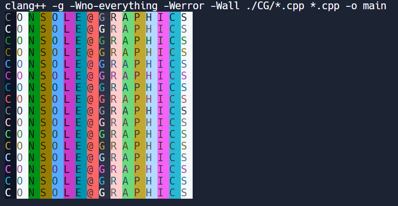
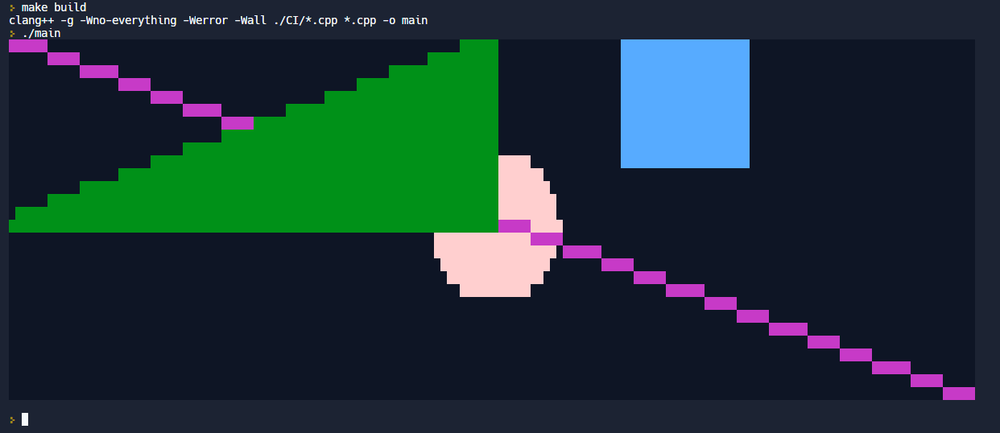
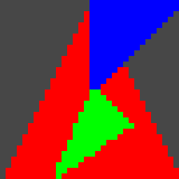

# ConsoleGraphics

Mini 2D graphics library in C++ for the console / terminal in LINUX.

It is able to create simple 2D shapes in the console (squares, circles, triangles, and lines). However, it is a little skewed vertically because of the console not 
having a 1:1 ratio. [NOT LONGER SKEWED because of SCALERS(see CG_Image.hpp/.cpp)]


## Quick Start
```console
$ make build
$ ./main
```
### To use the functions in your projects: 
* Download the `./CG/` folder to your project directory
* `#include` both .hpp files into the files you want to use it
1. Create an Image object with the Width and Height of the canvas you want
    `CG_Image myImage(WIDTH, HEIGHT);`
2. Use the functions the Image Class has to create your shapes 
3. Remember to use the `show()` function after everything to show your image
    `myImage.show();`

### References: 
#### For color codes and terminal manipulation:
- https://www.2daygeek.com/understanding-the-color-code-of-linux-files/
- https://web.archive.org/web/20151004211730/http://www.termsys.demon.co.uk/vtansi.htm/


## Examples
### `color_palatte();` 


### `all();` 


### `triangle();` 


### `checker();` 


### `circles();` 

