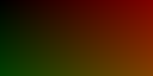
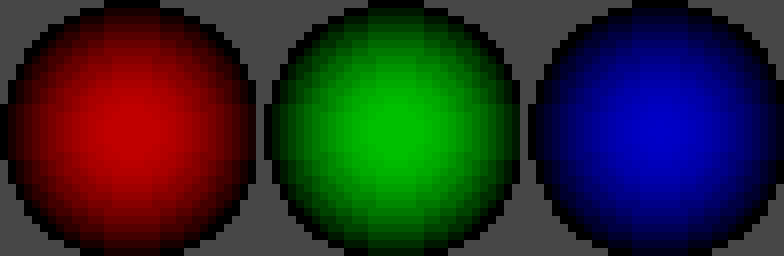

# ConsoleGraphics

Mini 2D graphics library in C++ for the console / terminal in LINUX.

It is able to create simple 2D shapes in the console (squares, circles, triangles, lines, and text!).

I've Attempted to scale the image by a WIDTH_SCALER to look better(check out ./CG/Image.hpp/.cpp)

In addition, you can now save images to png! I used the STB header library to save the images

## Quick Start
```console
$ make examples
$ ./bin/examples
```
### To use the functions in your projects: 
* Download the `./CG/` folder to your project directory
* `#include` all `.hpp` files into the files you want to use it
1. Create an Image object with the Width and Height of the canvas you want
    `CG::Image myImage(WIDTH, HEIGHT);`
2. Use the functions the `CG::Image` Class has to create your shapes 
3. Remember to use the `show()` function after everything to show your image
    `myImage.show();`
4. If you want to save your image to a png use `myImage.save_image(<File_path>, [Scale])` \
    File_path: provide the file where you want to save the image to **must end in .png** \
    Scale: optional argument to scale the image up. **Default = 1**, i.e original size

### References: 
#### For color codes and terminal manipulation:
- https://www.2daygeek.com/understanding-the-color-code-of-linux-files/
- https://web.archive.org/web/20151004211730/http://www.termsys.demon.co.uk/vtansi.htm/

#### For saving png images:
- https://github.com/nothings/stb

## Testing
TestCase.hpp/cpp are my take on implementing a unit test system.
```Console
$ make tests
$ ./bin/tests
```

## [Console Graphic Examples Website](https://barrales-d.github.io/ConsoleGraphics/) 
<!-- <style>
    ul {
        padding: 0;
        margin: 0;
        font-family: 'Consolas';
        list-style: none;
    }
    .image-gallery-cols {
        display: flex;
        flex-direction: row;
        flex-wrap: wrap;
        justify-content: space-between;
        padding: 5px;
        width: 90vw;
    }
    ul > li > img {outline: auto;}
    ul > li > p {text-align: center; font-size: 15px; font-weight: 600;}
</style>
<ul class="image-gallery-cols">
    <li>
        
        <p>All shapes in one</p>
    </li>
    <li>
        
        <p>Triangles</p>
    </li>
    <li>
        
        <p>Checker pattern</p>
    </li>
    <li>
        
        <p>Gradient</p>
    </li>
    <li>
        
        <p>Gradient circles</p>
    </li>
    <li>
        
        <p>Color palette</p>
    </li>
</ul> -->